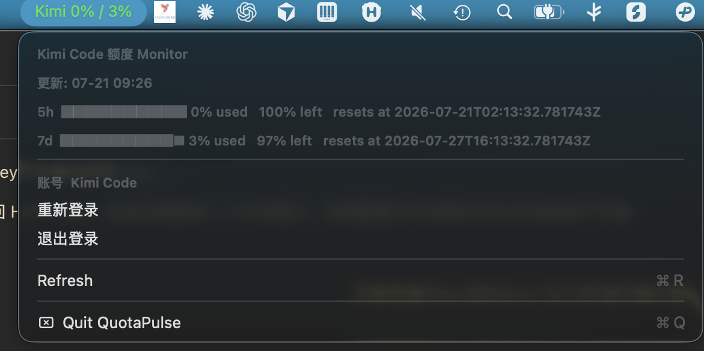

# QuotaPulse · 额度脉搏



[中文](./README.md)

A macOS menu bar app that shows your AI API quota / balance at a glance. No more tab-switching to check if you're about to run out of tokens.

Currently supports **GLM (Zhipu BigModel)**, **DeepSeek**, and **Kimi Code**.

## Features

- **GLM**: Shows 5h-window and 7-day-window quota usage percentages right in the menu bar. Color-coded by remaining quota (green → yellow → red). Click the menu to see exact reset countdowns.
- **DeepSeek**: Shows account balance in the menu bar. A colored dot indicates peak/off-peak billing (red = peak hours 9am–12pm & 2pm–6pm Shanghai time, ×2 rates). One-click toggle between Flash and Pro models.
- **Kimi Code**: Reads the existing Kimi Code CLI OAuth login from `~/.kimi/credentials/kimi-code.json` and shows subscription quota totals and windows. Expired tokens are refreshed automatically; a Kimi Code API key can also be configured manually.
- **Auto-refresh**: Fetches latest quota data every 5 minutes. Updates display colors every minute.
- **Local cache**: Works offline with cached data from the last successful fetch.
- **Pure menu bar**: No Dock icon, no windows, no interruptions. Just a number in your menu bar.

## Requirements

- macOS 12+
- Swift toolchain (for building from source)
- GLM, DeepSeek, or Kimi Code credentials/API key

## Quick Start

### Method 1: Use with CC Switch (current)

QuotaPulse reads your API key and provider selection automatically from [CC Switch](https://github.com/)'s local database. If you already use CC Switch to manage multiple AI coding tool providers, just install CC Switch and launch QuotaPulse — it auto-detects your current provider and key.

```bash
./build.sh
open ./outputs/QuotaPulse.app
```


### Method 2: Standalone (no CC Switch needed)

Don't want to install CC Switch? Paste your API key directly into QuotaPulse. Launch the app and, if no key is detected, a "Login / Configure API Key" item appears in the menu — click it to open a login window:

- **Choose provider**: GLM (Zhipu BigModel), DeepSeek, or Kimi Code. Kimi Code works automatically when the local CLI is already logged in, or you can paste a Kimi Code API key.
- **Paste API Key**: a secure text field — input is masked
- **Login**: saves the config and immediately refreshes; the key is stored at `~/.codex/.quota-pulse-config.json`

Once logged in, the menu shows the current account and offers "Re-login" / "Log out". Logging out clears the manual config and falls back to env vars / CC Switch detection.

**Key resolution priority**: manual login config > Kimi Code CLI OAuth > environment variables (`KIMI_API_KEY` / `GLM_API_KEY` / `ZHIPU_API_KEY` / `DEEPSEEK_API_KEY`) > CC Switch database.

### Kimi Code quota

- When Kimi Code CLI is signed in locally, QuotaPulse automatically reads `~/.kimi/credentials/kimi-code.json`; its OAuth token is refreshed automatically when needed.
- You can also choose Kimi Code under “Re-login” and paste a Kimi Code API key.
- The menu bar shows the 5-hour and 7-day usage percentages in that order, for example `Kimi 0% / 3%`. The expanded menu includes each window's used amount, remaining amount, and reset time.

## Build from Source

```bash
git clone https://github.com/Drok1015/quota-pulse.git
cd quota-pulse
./build.sh
open ./outputs/QuotaPulse.app
```

The app starts silently in your menu bar. Look for the quota percentage or balance number.

## How It Works

- Queries GLM's `/api/monitor/usage/quota/limit`, DeepSeek's `/user/balance`, or Kimi Code's `/coding/v1/usages` endpoint
- Extracts your API key from CC Switch's SQLite database (`~/.cc-switch/cc-switch.db`)
- Renders a single number or percentage in the macOS menu bar, color-coded by remaining quota
- A pulldown menu shows detailed breakdown: time windows, reset countdowns, peak-hour status, balance breakdown, and model switcher

## Tech Stack

Single-file Swift native app (~500 lines). Compiled with `swiftc -O`. No dependencies beyond Foundation and Cocoa.

## License

MIT
